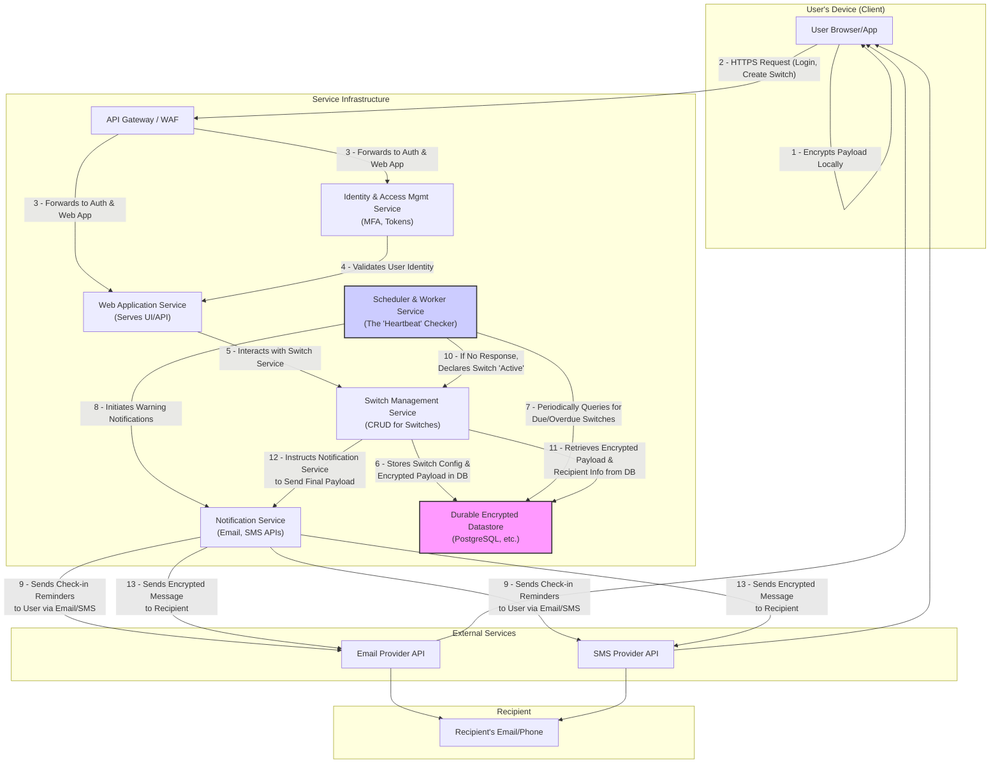

```mermaid
graph TD
    subgraph "User's Device (Client)"
        A[User Browser/App]
    end

    subgraph "Service Infrastructure"
        B[API Gateway / WAF]
        C["Identity & Access Mgmt Service<br>(MFA, Tokens)"]
        D["Web Application Service<br>(Serves UI/API)"]
        E["Switch Management Service<br>(CRUD for Switches)"]
        F["Scheduler & Worker Service<br>(The 'Heartbeat' Checker)"]
        G["Notification Service<br>(Email, SMS APIs)"]
        H["Durable Encrypted Datastore<br>(PostgreSQL, etc.)"]
    end

    subgraph "External Services"
        I[Email Provider API]
        J[SMS Provider API]
    end

    subgraph "Recipient"
        K[Recipient's Email/Phone]
    end

    %% Data Flow
    A -- "1 - Encrypts Payload Locally" --> A
    A -- "2 - HTTPS Request (Login, Create Switch)" --> B
    B -- "3 - Forwards to Auth & Web App" --> C & D
    C -- "4 - Validates User Identity" --> D
    D -- "5 - Interacts with Switch Service" --> E
    E -- "6 - Stores Switch Config &<br>Encrypted Payload in DB" --> H

    %% Check-in & Trigger Flow
    F -- "7 - Periodically Queries for<br>Due/Overdue Switches" --> H
    F -- "8 - Initiates Warning Notifications" --> G
    G -- "9 - Sends Check-in Reminders<br>to User via Email/SMS" --> I & J --> A

    %% Final Activation Flow
    F -- "10 - If No Response,<br>Declares Switch 'Active'" --> E
    E -- "11 - Retrieves Encrypted Payload &<br>Recipient Info from DB" --> H
    E -- "12 - Instructs Notification Service<br>to Send Final Payload" --> G
    G -- "13 - Sends Encrypted Message<br>to Recipient" --> I & J --> K

    style H fill:#f9f,stroke:#333,stroke-width:2px
    style F fill:#ccf,stroke:#333,stroke-width:2px
```
